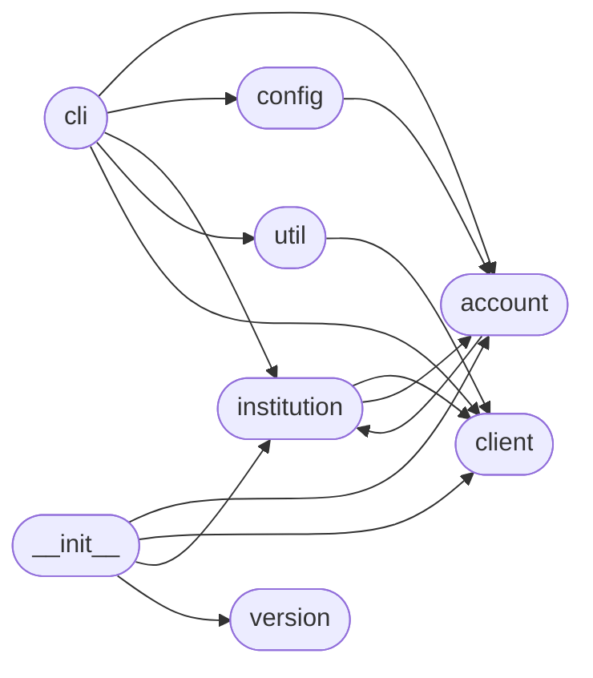

# Code Overview

[_Documentation generated by Documatic_](https://www.documatic.com)

<!---Documatic-section-Codebase Structure Python-start--->
## Codebase Structure Python

The codebase has a flat structure, with 8 code files.

<!---Documatic-block-system_architecture-start--->

<!---Documatic-block-system_architecture-end--->

# #
<!---Documatic-section-Codebase Structure Python-end--->

<!---Documatic-section-Key Infrastructure-start--->
## Key Infrastructure

### MongoDB is used in:

* `authenticate` of `ofxclient.institution.Institution`

# #
<!---Documatic-section-Key Infrastructure-end--->

<!---Documatic-section-Key Objects-start--->
## Key Objects

There are exposed imports at level-0
from the source directory (ofxclient)

<!---Documatic-block-ofxclie-start--->

	
<code>ofxclie</code> (Click to Expand!)

* `ofxclient.account.Account`
* `ofxclient.account.BankAccount`
* `ofxclient.account.BrokerageAccount`
* `ofxclient.account.CreditCardAccount`
* `ofxclient.client.Client`
* `ofxclient.institution.Institution`
* `ofxclient.version.__version__`

<!---Documatic-block-ofxclie-end--->

# #
<!---Documatic-section-Key Objects-end--->

<!---Documatic-section-Important Functions-start--->
## Important Functions

<!---Documatic-block-important_funcs-start--->
<!---Documatic-block-most_used_funcs-start--->
### Most Utilised Functions

* [ofxclient.util.combined_download](6-ofxclient_util.md#ofxclient.util.combined_download) (1 times)
* ofxclient.version.__version__ (1 times)
<!---Documatic-block-most_used_funcs-end--->

<!---Documatic-block-end_user_funcs-start--->
### End User Exposed Functions

* [ofxclient.client.Client](7-ofxclient_client.md#ofxclient.client.Client)
* ofxclient.version.__version__
* [ofxclient.account.BrokerageAccount](5-ofxclient_account.md#ofxclient.account.BrokerageAccount)
* [ofxclient.account.BankAccount](5-ofxclient_account.md#ofxclient.account.BankAccount)
* [ofxclient.account.Account](5-ofxclient_account.md#ofxclient.account.Account)
* [ofxclient.account.CreditCardAccount](5-ofxclient_account.md#ofxclient.account.CreditCardAccount)
* [ofxclient.institution.Institution](3-ofxclient_institution.md#ofxclient.institution.Institution)
<!---Documatic-block-end_user_funcs-end--->
<!---Documatic-block-important_funcs-end--->

# #
<!---Documatic-section-Important Functions-end--->

<!---Documatic-section-File IO-start--->
## File IO

<!---Documatic-block-file_io-start--->
The following files have file read operations

<!---Documatic-block-ofxclient-start--->

	
<code>ofxclient</code> (Click to Expand!)

* ofxclient.config

<!---Documatic-block-ofxclient-end--->

The following files have file write operations

<!---Documatic-block-ofxclient-start--->

	
<code>ofxclient</code> (Click to Expand!)

* ofxclient.config

<!---Documatic-block-ofxclient-end--->
<!---Documatic-block-file_io-end--->

# #
<!---Documatic-section-File IO-end--->

<!---Documatic-section-Class Hierarchy-start--->
## Class Hierarchy

<!---Documatic-block-object-start--->

	
<code>object</code> (Click to Expand!)

* [ofxclient.account.Account](5-ofxclient_account.md#ofxclient.account.Account)
* ofxclient.config.OfxConfig
* [ofxclient.institution.Institution](3-ofxclient_institution.md#ofxclient.institution.Institution)

<!---Documatic-block-object-end--->

<!---Documatic-block-ofxclient.account.Account-start--->

	
<code>ofxclient.account.Account</code> (Click to Expand!)

* [ofxclient.account.BankAccount](5-ofxclient_account.md#ofxclient.account.BankAccount)
* [ofxclient.account.BrokerageAccount](5-ofxclient_account.md#ofxclient.account.BrokerageAccount)
* [ofxclient.account.CreditCardAccount](5-ofxclient_account.md#ofxclient.account.CreditCardAccount)

<!---Documatic-block-ofxclient.account.Account-end--->

<!---Documatic-block-ofxclient.config.SecurableConfigParser-start--->

	
<code>ofxclient.config.SecurableConfigParser</code> (Click to Expand!)

* ofxclient.config.SecurableConfigParser

<!---Documatic-block-ofxclient.config.SecurableConfigParser-end--->

# #
<!---Documatic-section-Class Hierarchy-end--->

[_Documentation generated by Documatic_](https://www.documatic.com)