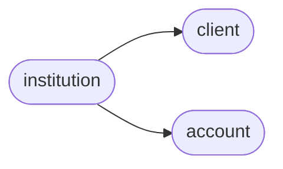

# Ofxclient Institution

[_Documentation generated by Documatic_](https://www.documatic.com)

<!---Documatic-section-Codebase Structure-start--->
## Codebase Structure

<!---Documatic-block-system_architecture-start--->

<!---Documatic-block-system_architecture-end--->

# #
<!---Documatic-section-Codebase Structure-end--->

<!---Documatic-section-ofxclient.institution.Institution-start--->
## [ofxclient.institution.Institution](3-ofxclient_institution.md#ofxclient.institution.Institution)

<!---Documatic-section-Institution-start--->
<!---Documatic-block-ofxclient.institution.Institution-start--->
<details>
	<summary><code>ofxclient.institution.Institution</code> code snippet</summary>

```python
class Institution(object):

    def __init__(self, id, org, url, username, password, broker_id='', description=None, client_args={}):
        self.id = id
        self.org = org
        self.url = url
        self.broker_id = broker_id
        self.username = username
        self.password = password
        self.description = description or self._default_description()
        self.client_args = client_args

    def client(self):
        """Build a :py:class:`ofxclient.Client` for talking with the bank

        It implicitly passes in the ``client_args`` that were passed
        when instantiating this ``Institution``.

        :rtype: :py:class:`ofxclient.Client`
        """
        return Client(institution=self, **self.client_args)

    def local_id(self):
        """Locally generated unique account identifier.

        :rtype: string
        """
        return hashlib.sha256(('%s%s' % (self.id, self.username)).encode()).hexdigest()

    def _default_description(self):
        return self.org

    def authenticate(self, username=None, password=None):
        """Test the authentication credentials

        Raises a ``ValueError`` if there is a problem authenticating
        with the human readable reason given by the institution.

        :param username: optional username (use self.username by default)
        :type username: string or None
        :param password: optional password (use self.password by default)
        :type password: string or None
        """
        u = self.username
        p = self.password
        if username and password:
            u = username
            p = password
        client = self.client()
        query = client.authenticated_query(username=u, password=p)
        res = client.post(query)
        ofx = BeautifulSoup(res, 'lxml')
        sonrs = ofx.find('sonrs')
        code = int(sonrs.find('code').contents[0].strip())
        try:
            status = sonrs.find('message').contents[0].strip()
        except Exception:
            status = ''
        if code == 0:
            return 1
        raise ValueError(status)

    def accounts(self):
        """Ask the bank for the known :py:class:`ofxclient.Account` list.

        :rtype: list of :py:class:`ofxclient.Account` objects
        """
        from ofxclient.account import Account
        client = self.client()
        query = client.account_list_query()
        resp = client.post(query)
        resp_handle = StringIO(resp)
        if IS_PYTHON_2:
            parsed = OfxParser.parse(resp_handle)
        else:
            parsed = OfxParser.parse(BytesIO(resp_handle.read().encode()))
        return [Account.from_ofxparse(a, institution=self) for a in parsed.accounts]

    def serialize(self):
        """Serialize predictably for use in configuration storage.

        Output looks like this::

          {
            'local_id':    'unique local identifier',
            'id':          'FI Id',
            'org':         'FI Org',
            'url':         'FI OFX Endpoint Url',
            'broker_id':   'FI Broker Id',
            'username':    'Customer username',
            'password':    'Customer password',
            'description': 'descr',
            'client_args': {
                'id':     'random client id - see Client() for default',
                'app_id': 'app name - see Client() for default',
                '...':    'see Client() for other options'
            }
          }

        :rtype: nested dictionary
        """
        return {'id': self.id, 'org': self.org, 'url': self.url, 'broker_id': self.broker_id, 'username': self.username, 'password': self.password, 'description': self.description, 'client_args': self.client().init_args, 'local_id': self.local_id()}

    @staticmethod
    def deserialize(raw):
        """Instantiate :py:class:`ofxclient.Institution` from dictionary

        :param raw: serialized ``Institution``
        :param type: dict per :py:method:`~Institution.serialize`
        :rtype: subclass of :py:class:`ofxclient.Institution`
        """
        return Institution(id=raw['id'], org=raw['org'], url=raw['url'], broker_id=raw.get('broker_id', ''), username=raw['username'], password=raw['password'], description=raw.get('description', None), client_args=raw.get('client_args', {}))
```
</details>
<!---Documatic-block-ofxclient.institution.Institution-end--->
<!---Documatic-section-Institution-end--->

# #
<!---Documatic-section-ofxclient.institution.Institution-end--->

[_Documentation generated by Documatic_](https://www.documatic.com)