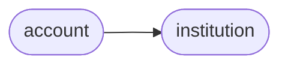

# Ofxclient Account

[_Documentation generated by Documatic_](https://www.documatic.com)

<!---Documatic-section-Codebase Structure-start--->
## Codebase Structure

<!---Documatic-block-system_architecture-start--->

<!---Documatic-block-system_architecture-end--->

# #
<!---Documatic-section-Codebase Structure-end--->

<!---Documatic-section-ofxclient.account.BrokerageAccount-start--->
## [ofxclient.account.BrokerageAccount](5-ofxclient_account.md#ofxclient.account.BrokerageAccount)

<!---Documatic-section-BrokerageAccount-start--->
<!---Documatic-block-ofxclient.account.BrokerageAccount-start--->
<details>
	<summary><code>ofxclient.account.BrokerageAccount</code> code snippet</summary>

```python
class BrokerageAccount(Account):

    def __init__(self, broker_id, **kwargs):
        super(BrokerageAccount, self).__init__(**kwargs)
        self.broker_id = broker_id

    def _download_query(self, as_of):
        """Formulate the specific query needed for download

        Not intended to be called by developers directly.

        :param as_of: Date in 'YYYYMMDD' format
        :type as_of: string
        """
        c = self.institution.client()
        q = c.brokerage_account_query(number=self.number, date=as_of, broker_id=self.broker_id)
        return q
```
</details>
<!---Documatic-block-ofxclient.account.BrokerageAccount-end--->
<!---Documatic-section-BrokerageAccount-end--->

# #
<!---Documatic-section-ofxclient.account.BrokerageAccount-end--->

<!---Documatic-section-ofxclient.account.BankAccount-start--->
## [ofxclient.account.BankAccount](5-ofxclient_account.md#ofxclient.account.BankAccount)

<!---Documatic-section-BankAccount-start--->
<!---Documatic-block-ofxclient.account.BankAccount-start--->
<details>
	<summary><code>ofxclient.account.BankAccount</code> code snippet</summary>

```python
class BankAccount(Account):

    def __init__(self, routing_number, account_type, **kwargs):
        super(BankAccount, self).__init__(**kwargs)
        self.routing_number = routing_number
        self.account_type = account_type

    def _download_query(self, as_of):
        """Formulate the specific query needed for download

        Not intended to be called by developers directly.

        :param as_of: Date in 'YYYYMMDD' format
        :type as_of: string
        """
        c = self.institution.client()
        q = c.bank_account_query(number=self.number, date=as_of, account_type=self.account_type, bank_id=self.routing_number)
        return q
```
</details>
<!---Documatic-block-ofxclient.account.BankAccount-end--->
<!---Documatic-section-BankAccount-end--->

# #
<!---Documatic-section-ofxclient.account.BankAccount-end--->

<!---Documatic-section-ofxclient.account.Account-start--->
## [ofxclient.account.Account](5-ofxclient_account.md#ofxclient.account.Account)

<!---Documatic-section-Account-start--->
<!---Documatic-block-ofxclient.account.Account-start--->
<details>
	<summary><code>ofxclient.account.Account</code> code snippet</summary>

```python
class Account(object):

    def __init__(self, number, institution, description=None):
        self.institution = institution
        self.number = number
        self.description = description or self._default_description()

    def local_id(self):
        """Locally generated unique account identifier.

        :rtype: string
        """
        return hashlib.sha256(('%s%s' % (self.institution.local_id(), self.number)).encode()).hexdigest()

    def number_masked(self):
        """Masked version of the account number for privacy.

        :rtype: string
        """
        return '***%s' % self.number[-4:]

    def long_description(self):
        """Long description of the account (includes institution description).

        :rtype: string
        """
        return '%s: %s' % (self.institution.description, self.description)

    def _default_description(self):
        return self.number_masked()

    def download(self, days=60):
        """Downloaded OFX response for the given time range

        :param days: Number of days to look back at
        :type days: integer
        :rtype: :py:class:`StringIO`

        """
        days_ago = datetime.datetime.now() - datetime.timedelta(days=days)
        as_of = time.strftime('%Y%m%d', days_ago.timetuple())
        query = self._download_query(as_of=as_of)
        response = self.institution.client().post(query)
        return StringIO(response)

    def download_parsed(self, days=60):
        """Downloaded OFX response parsed by :py:meth:`OfxParser.parse`

        :param days: Number of days to look back at
        :type days: integer
        :rtype: :py:class:`ofxparser.Ofx`
        """
        if IS_PYTHON_2:
            return OfxParser.parse(self.download(days=days))
        else:
            return OfxParser.parse(BytesIO(self.download(days=days).read().encode()))

    def statement(self, days=60):
        """Download the :py:class:`ofxparse.Statement` given the time range

        :param days: Number of days to look back at
        :type days: integer
        :rtype: :py:class:`ofxparser.Statement`
        """
        parsed = self.download_parsed(days=days)
        return parsed.account.statement

    def transactions(self, days=60):
        """Download a a list of :py:class:`ofxparse.Transaction` objects

        :param days: Number of days to look back at
        :type days: integer
        :rtype: list of :py:class:`ofxparser.Transaction` objects
        """
        return self.statement(days=days).transactions

    def serialize(self):
        """Serialize predictably for use in configuration storage.

        Output look like this::

          {
            'local_id':       'string',
            'number':         'account num',
            'description':    'descr',
            'broker_id':      'may be missing - type dependent',
            'routing_number': 'may be missing - type dependent,
            'account_type':   'may be missing - type dependent,
            'institution': {
                # ... see :py:meth:`ofxclient.Institution.serialize`
            }
          }

        :rtype: nested dictionary
        """
        data = {'local_id': self.local_id(), 'institution': self.institution.serialize(), 'number': self.number, 'description': self.description}
        if hasattr(self, 'broker_id'):
            data['broker_id'] = self.broker_id
        elif hasattr(self, 'routing_number'):
            data['routing_number'] = self.routing_number
            data['account_type'] = self.account_type
        return data

    @staticmethod
    def deserialize(raw):
        """Instantiate :py:class:`ofxclient.Account` subclass from dictionary

        :param raw: serilized Account
        :param type: dict as  given by :py:meth:`~ofxclient.Account.serialize`
        :rtype: subclass of :py:class:`ofxclient.Account`
        """
        from ofxclient.institution import Institution
        institution = Institution.deserialize(raw['institution'])
        del raw['institution']
        del raw['local_id']
        if 'broker_id' in raw:
            a = BrokerageAccount(institution=institution, **raw)
        elif 'routing_number' in raw:
            a = BankAccount(institution=institution, **raw)
        else:
            a = CreditCardAccount(institution=institution, **raw)
        return a

    @staticmethod
    def from_ofxparse(data, institution):
        """Instantiate :py:class:`ofxclient.Account` subclass from ofxparse
        module

        :param data: an ofxparse account
        :type data: An :py:class:`ofxparse.Account` object
        :param institution: The parent institution of the account
        :type institution: :py:class:`ofxclient.Institution` object
        """
        description = data.desc if hasattr(data, 'desc') else None
        if data.type == AccountType.Bank:
            return BankAccount(institution=institution, number=data.account_id, routing_number=data.routing_number, account_type=data.account_type, description=description)
        elif data.type == AccountType.CreditCard:
            return CreditCardAccount(institution=institution, number=data.account_id, description=description)
        elif data.type == AccountType.Investment:
            return BrokerageAccount(institution=institution, number=data.account_id, broker_id=data.brokerid, description=description)
        raise ValueError('unknown account type: %s' % data.type)
```
</details>
<!---Documatic-block-ofxclient.account.Account-end--->
<!---Documatic-section-Account-end--->

# #
<!---Documatic-section-ofxclient.account.Account-end--->

<!---Documatic-section-ofxclient.account.CreditCardAccount-start--->
## [ofxclient.account.CreditCardAccount](5-ofxclient_account.md#ofxclient.account.CreditCardAccount)

<!---Documatic-section-CreditCardAccount-start--->
<!---Documatic-block-ofxclient.account.CreditCardAccount-start--->
<details>
	<summary><code>ofxclient.account.CreditCardAccount</code> code snippet</summary>

```python
class CreditCardAccount(Account):

    def __init__(self, **kwargs):
        super(CreditCardAccount, self).__init__(**kwargs)

    def _download_query(self, as_of):
        """Formulate the specific query needed for download

        Not intended to be called by developers directly.

        :param as_of: Date in 'YYYYMMDD' format
        :type as_of: string
        """
        c = self.institution.client()
        q = c.credit_card_account_query(number=self.number, date=as_of)
        return q
```
</details>
<!---Documatic-block-ofxclient.account.CreditCardAccount-end--->
<!---Documatic-section-CreditCardAccount-end--->

# #
<!---Documatic-section-ofxclient.account.CreditCardAccount-end--->

[_Documentation generated by Documatic_](https://www.documatic.com)