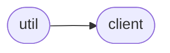
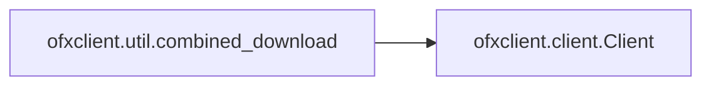

# Ofxclient Util

[_Documentation generated by Documatic_](https://www.documatic.com)

<!---Documatic-section-Codebase Structure-start--->
## Codebase Structure

<!---Documatic-block-system_architecture-start--->

<!---Documatic-block-system_architecture-end--->

# #
<!---Documatic-section-Codebase Structure-end--->

<!---Documatic-section-ofxclient.util.combined_download-start--->
## [ofxclient.util.combined_download](6-ofxclient_util.md#ofxclient.util.combined_download)

<!---Documatic-section-combined_download-start--->


### Object Calls

* [ofxclient.client.Client](7-ofxclient_client.md#ofxclient.client.Client)

<!---Documatic-block-ofxclient.util.combined_download-start--->
<details>
	<summary><code>ofxclient.util.combined_download</code> code snippet</summary>

```python
def combined_download(accounts, days=60):
    client = Client(institution=None)
    out_file = StringIO()
    out_file.write(client.header())
    out_file.write('<OFX>')
    for a in accounts:
        ofx = a.download(days=days).read()
        stripped = ofx.partition('<OFX>')[2].partition('</OFX>')[0]
        out_file.write(stripped)
    out_file.write('</OFX>')
    out_file.seek(0)
    return out_file
```
</details>
<!---Documatic-block-ofxclient.util.combined_download-end--->
<!---Documatic-section-combined_download-end--->

# #
<!---Documatic-section-ofxclient.util.combined_download-end--->

[_Documentation generated by Documatic_](https://www.documatic.com)